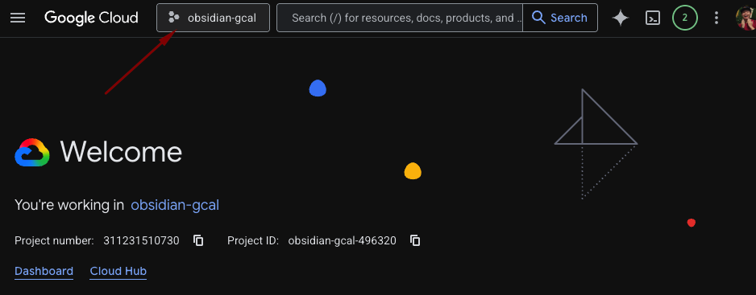
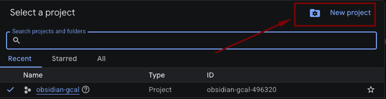
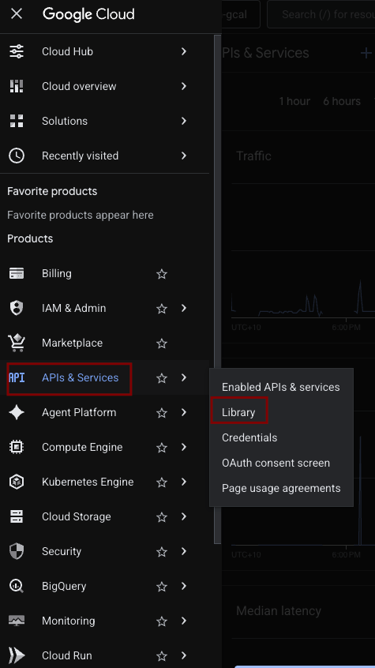
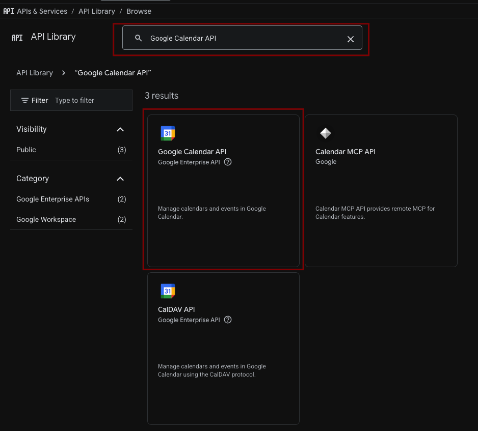
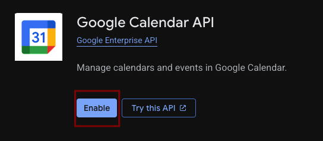
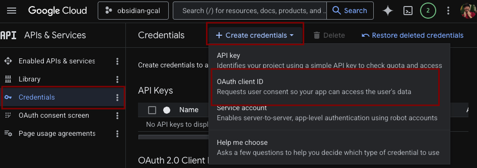
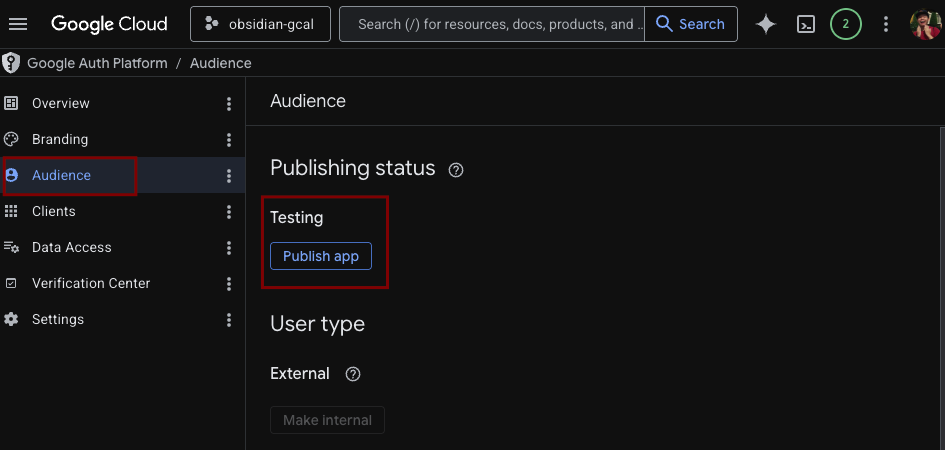

# GCal Sidebar (or testing name was Obsidian-Gcal)

An interactive Google Calendar sidebar for Obsidian. Multiple accounts, bi-directional sync, drag to move, accept/reject invites.

**Desktop only.**

---

## Features

- Multiple Google accounts in one view
- Day / 3-day / Week view with density toggle
- Drag to move events
- Create events by clicking or dragging an empty slot
- Edit events (title, time, recurrence, guests, location, description)
- Accept, decline, or mark tentative on invites
- Recurring event support (this event / this and following / all events)
- Mini month navigation
- Calendar show/hide toggles per account
- Keyboard shortcuts for common actions

---

## Requirements

- Obsidian desktop (Windows, macOS, Linux)
- A Google account
- A Google Cloud project with the Calendar API enabled (free, takes ~5 minutes to set up)

---

# How to Setup
## Google Cloud Setup

You need your own GCP credentials. This keeps your tokens local to your machine and off any third-party server.

### 1. Create a GCP project

1. Go to [console.cloud.google.com](https://console.cloud.google.com)
2. Click the project selector at the top → **New Project**

3. Name it anything (e.g. `obsidian-gcal-sidebar`) → **Create**
    - No organisation is needed

### 2. Enable the Google Calendar API

1. In the left sidebar: **APIs & Services → Library**

2. Search for **Google Calendar API**

3. Click it → **Enable**

### 3. Create OAuth credentials

1. **APIs & Services → Credentials → Create Credentials → OAuth client ID**

2. If prompted to configure the consent screen first:
   - User type: **External**
   - Fill in App name (anything, e.g. `obsidian-gcal-sidebar`), your email for both support and developer contact fields
   - Skip scopes, skip test users
   - Save and continue back to credentials
3. Application type: **Desktop app**
4. Name it anything (e.g. `obsidian-gcal-sidebar`) → **Create**
5. Copy the **Client ID** and **Client Secret** — you'll need both

### 4. Publish the consent screen

1. Go to APIs & Services → OAuth consent screen → Audience
2. click Publish App

3. Confirm

---

## Installation in Obsidian

### From the Obsidian community plugin store

1. **Settings → Community plugins → Browse**
2. Search for **GCal Sidebar**
3. Install → Enable

### Manual install

1. Download `main.js`, `manifest.json`, and `styles.css` from the [latest release](https://github.com/ShawnSomething/obsidian-gcal/releases)
2. Create a folder at `<your vault>/.obsidian/plugins/gcal-sidebar/`
3. Drop the three files in
4. **Settings → Community plugins** → enable **GCal Sidebar**

---

## Plugin Setup

1. Open **Settings → GCal Sidebar**
2. Paste your **Client ID** and **Client Secret** from the **Google Cloud Setup** before
3. Click **Add Account**
4. Your browser will open a Google sign-in page

### The "This app isn't verified" screen

You will see a Google warning. This is expected — the app is running under your own GCP project, which hasn't gone through Google's verification process.

Click **Advanced → Go to [app name] (unsafe)** to continue. Your credentials stay on your device and are never sent or saved anywhere other than Google's own servers.

5. Sign in and grant calendar access
6. The browser will show a confirmation — you can close it
7. The sidebar will open and load your calendars

### Adding more accounts

Repeat steps 3–7 for each additional Google account. All accounts appear in the same calendar view.

---

## Usage

### Opening the sidebar

Click the calendar icon in the left ribbon, or use the command palette: **GCal Sidebar: Open Google Calendar**.

### Keyboard shortcuts

Defaults — all remappable in **Settings → Hotkeys**.
They are all set to none as a default, please feel free to set them up as you prefer

| Action | Default |
|---|---|
| Open calendar | none (set one in Hotkeys) |
| Day view | none |
| 3-day view | none |
| Week view | none |
| Jump to today | none |
| Refresh | none |
| Previous | none |
| Next | none |

### Creating events

Click an empty time slot to create a new event. Click and drag to set the duration. Fill in the details and save.

### Editing events

Click any event to open it. Edit title, time, guests, location, description, or recurrence.

### Moving events

Drag an event to a new time. Changes sync immediately.

### Accepting / declining invites

Click an event → use the **Yes / Maybe / No** buttons at the top of the modal.

### Showing / hiding calendars

Click the grid icon in the header to open the calendar list. Toggle any calendar on or off. Use the **↗** button next to an account to open it in Google Calendar.

---

## Data & Privacy

- Tokens are stored locally in your vault's `data.json` file
- Nothing is sent to any third-party server
- All API calls go directly from your machine to Google

---

## Troubleshooting

**Events not loading**
Try the refresh button (↻) in the header. If that doesn't work, check that your Client ID and Secret are correct in settings.

**"This app isn't verified" keeps showing**
This is normal for self-hosted GCP projects. Just click Advanced -> Continue to proceed

**Port already in use**
The plugin tries ports 42813–42817 for the OAuth callback. If all five are blocked, the auth flow will fail. Free up one of those ports and try again.

**Calendar stopped syncing**
Your access token may have expired and failed to refresh. Remove and re-add the account in settings.

---

## License

MIT
